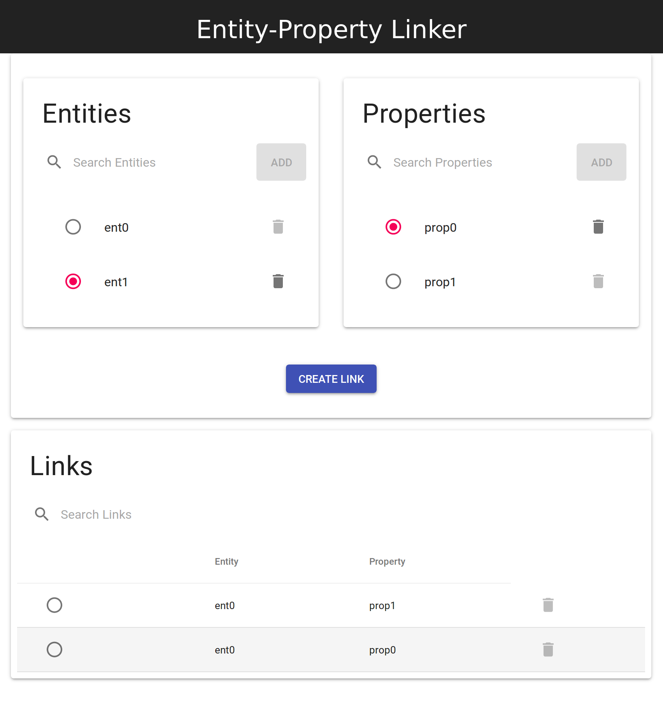

# Entity-Property Linker

A simple Dockerized CRUD app using [Postgres](https://www.postgresql.org/), [Express](https://expressjs.com/), and [React](https://reactjs.org/) that manages a simple join table relationship.
Migrations are handled in the API and use [db-migrate](https://github.com/db-migrate/node-db-migrate).
The purpose of this project was to refresh my React skills and teach myself how to work with [Material-UI](https://material-ui.com/).
The most important part of this project (and I would very much like feedback on this) are the [Design decisions](#design-decisions).

- [Entity-Property Linker](#entity-property-linker)
  - [Design decisions](#design-decisions)
  - [Prerequisites](#prerequisites)
  - [Running the application](#running-the-application)
    - [Startup](#startup)
    - [Teardown](#teardown)
  - [Configuration](#configuration)
    - [Database](#database)
    - [UI/API](#uiapi)
  - [Development](#development)
    - [Linting/Auto-formatting](#lintingauto-formatting)
    - [Database Migrations](#database-migrations)
    - [UI only](#ui-only)
  - [Known Issues](#known-issues)



Design inspired by this [ui.StackExchange post](https://ux.stackexchange.com/a/25723)


## Design decisions

Priority number 1: enable the of delivery business value

1. Dockerized from the start

   To deliver business value the fastest, you should be in a deployable state from day one. This enables the agile practice of iterative development, and allows stakeholders earlier opportunities to give feedback, saving development time. I'm assuming you know how to deploy Docker apps.

2. A single repo instead of 2. Why? 1 PR for everything instead of 1 PR for the API, and then another for the UI

   This also makes deployments easier as some changes might be tightly coupled between, the API and UI. THis enables you to deliver business value faster.

   Check out this artifle

3. Migrations, migrations, migrations (see [Pattern: Database per service](https://microservices.io/patterns/data/database-per-service.html))

   You need migrations. Don't create separate files that you need to run manually. Your application should be as easy to run and deploy as possible. Migrations enable this, and allow you to deliver business value faster.

4. UI React components grouped by features (see [File Structure](https://reactjs.org/docs/faq-structure.html#grouping-by-features-or-routes))

   Organizing code by features allows you to spend less time trying to figure out all the relationships between code and more time devlivering business value.

   > As a developer, it is common to spend more time figuring out what the code does rather than actually writing code. - [Alexis Mangin](https://medium.com/@alexmngn)

   > When you work on a large project, it can be a difficult to identity to origin of an issue. As a developer, you might spend valuable time digging through thousands of lines of code until you understand all the relationships. Organizing your code by modules means you start thinking around a concept where you break down your code into related pieces and provide a public interface to use your module. It helps maximize code sharing and reusability in different sections of your application and even on other projects.

   See: [Why React developers should modularize their applications?](https://medium.com/@alexmngn/why-react-developers-should-modularize-their-applications-d26d381854c1)

5. API calls should live separately from React components.

   > React is a declarative, efficient, and flexible JavaScript library for building user interfaces. - [What is React](https://reactjs.org/tutorial/tutorial.html#what-is-react)

   If there's one place in your app where business logic will be present, it would be close to the API calls. You may need to transform the data returned from the API before presenting it. This business logic should be separate from the React component itself.

   This business logic could be different from scene to scene (see [How to better organize your React applications?](https://medium.com/@alexmngn/how-to-better-organize-your-react-applications-2fd3ea1920f1)). Knowing this, while we want to isolate the business logic and API calls from the components themselves, they should remain in the context of the business feature (or [scene](https://medium.com/@alexmngn/how-to-better-organize-your-react-applications-2fd3ea1920f1)). This allows developers to remain in the context of the feature or scene being developed when delivering business value. If a global API service is implemented, it will quickly outgrow to the point where it becomes less readable and maintainable merely due to its size. Keeping the services, including the API, within the context of a given feature or scene limits this overgrowth. This goes hand in with grouping components into by features (see [Grouping by Features or Routes](https://reactjs.org/docs/faq-structure.html#grouping-by-features-or-routes)). This enables you to deliver business value faster.

6. JSON objects returned from API should mirror their corresponding DB schemas.

   This removes ambiguity in dealing with JSON objects that represent database objects, and respect the database schema as the single source of truth for their structure. The less ambiguity, the more certainty, and the more likely you're able to deliver business value quickly.

   Since the API calls are in the same file as everything else for a given component (see #5), it's easy to change this structure as needed, as you only need to modify a single file in the UI. The fewer files you need to change when the schema for a DB object changes, the more quickly you'll be able to deliver business value.

7. Most logs are at the debug level

   You don't want to crowd out the logs. There is value in delineating between debug, info, warn, etc. Log levels allow you to filter for the logs you care about quickly, enabling you to deliver business value faster.

8. Don't write more tests than necessary

   Writing tests take time. Only write tests that directly translate into one of the necessary capabilities of the product from a _business_ perspective, not a _technical_ perspective. This is also why you should organize your components according to features as opposed to component types.

   The way I like to think of what is necessary and what isn't is by asking myself: "Does this operation affect what's stored in the database?". The whole point of computing is, after all, to modify the state of your store. Most front-end applications are CRUD (Create, Read Update, Delete) applications. In other words, they're user-friendly interfaces to a database.

   For example: I'll write a test that ensures that you can link an `Entity` with a `Property`, as that's a necessary capability of the product, and translates to a change of state of the database. However, it's not necessary to write a test to make sure that a "Link" button changes color when pressed, as that is neither a business-critical function of the application, nor does it translate to a database change.

   Take this with a grain of salt (I'm not a professional QA Engineer).

9. Use the most popular component libraries that satisfy business requirements.

   Unless absolutely necessary (e.g., legal data privacy regulations), don't use custom libraries, as it will be more difficult for you to find support for issues you run into, and therefore making it more difficult for you to deliver business value.

   A rule of thumb: the more popular a software library is, the more support it has. The more support it has, the easier it is to find solutions to common problems that you'll run into when trying to develop a feature. These learned lessons are taken into account and implemented in the corresponding library to make it easier to use. Libraries that are easier to use will help you deliver business value faster.

10. Use auto-formatting

    Maintainable software enables the quick delivery of business value. Auto-linting takes the effort out of maintaining a readable codebase, making it easy to keep the code readable. Readable code is maintainable code. Maintainable code translates into enabling the delivery of business value quickly.

## Prerequisites

- [docker](https://docs.docker.com/install/)
- [docker-compose](https://docs.docker.com/compose/install/)
- [nvm](https://github.com/creationix/nvm)
  Load the version of node used in the project:
  ```bash
  nvm use
  ```

## Running the application

### Startup

```bash
docker-compose build
docker-compose up
```

Open browser to [http://localhost:5000](http://localhost:5000)

### Teardown

Press `Ctrl+C` if in the same terminal instance running the app.
Then run the following:

```bash
docker-compose down
```

## Configuration

### Database

Credentials: see [docker-compose.yml](docker-compose.yml) and [api/config/database.json](api/config/database.json) (they should match)

### UI/API

Make sure the relevant environment vars in [docker-compose.yml](docker-compose.yml) and [ui/config/api.json](ui/config/api.json) match.

## Development

### Linting/Auto-formatting

Uses the following VS Code plugin:

Name: Prettier - Code formatter
Id: esbenp.prettier-vscode
Description: VS Code plugin for prettier/prettier
Version: 1.8.1
Publisher: Esben Petersen
VS Marketplace Link: https://marketplace.visualstudio.com/items?itemName=esbenp.prettier-vscode

### Database Migrations

1.  Start database

    ```bash
    docker-compose up database
    ```

2.  Run migrations forward

    ```bash
    docker-compose run api run npm migrate
    ```

3.  Run migrations backwards

    ```bash
    docker-compose run api run npm rollback
    ```

    See [api/migrations/sqls](api/migrations/sqls) (new migrations: [create](https://db-migrate.readthedocs.io/en/latest/Getting%20Started/commands/#create))

### UI only

1. Install project-wide dev dependencies

   ```bash
   npm install --dev
   ```

2. Start database and api

   ```bash
   docker-compose up database api
   ```

3. In a separate terminal, start the UI

   ```bash
   cd ui
   npm start
   ```

4. Navigate to [http://localhost:3000](http://localhost:3000)

## Known Issues

- In [Links](ui/src/linker/Links.js), the table head has weird behavior when scrolling (see open issue: [https://github.com/mui-org/material-ui/issues/6625](https://github.com/mui-org/material-ui/issues/6625))
